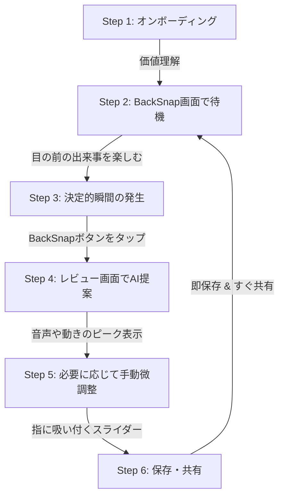

# 新規アプリ企画書：BackSnap

> **〜 “今の撮れた？”をなくす。AIが最高の一瞬をあとから切り抜くスマートカメラアプリ 〜**

## 【アプリの一言説明】
> [!NOTE]
> **BackSnap**は、撮り逃したくない一瞬をあとからAIが見つけて、SNS用にすぐ切り抜けるスマートカメラアプリです。

---

## 1. プロジェクト概要・コンセプト

> 「最高の瞬間は、録画ボタンを押す前に起きている。」

子どもの初めての成功、ペットのかわいい動き、友人とのハプニング、スポーツの決定的瞬間。本当に残したい場面は、いつも突然起きます。しかし従来のカメラアプリでは、ユーザーが事前に録画開始のタイミングを決める必要があります。
そのため、「今の撮れた？」「録画しておけばよかった」「長く撮りすぎて編集が面倒」という体験が頻繁に発生します。

本アプリは、決定的瞬間が起きたあとにボタンを押すだけで、直前の映像を確保し、AIが最もおいしい切り抜き範囲を提案してくれるスマート動画キャプチャアプリです。
従来の「録画してから編集する」体験ではなく、「とりあえず確保する → AIがベストシーンを提案する → すぐ保存・共有する」という、事後セレクト型の新しいカメラUXを提供します。

アプリの本質的な価値は、撮影そのものではなく、**“撮り逃しの不安”**と**“編集の面倒さ”**を同時に消すことです。

---

## 2. ターゲットユーザー

- **日常の撮影者**: 子どもやペットの成長・かわいい瞬間を日常的に撮影している人。
- **アクティブユーザー**: スポーツ、スケボー、ダンス、釣り、旅行、イベントなど、成功やハプニングの瞬間を撮りたい人。
- **SNSクリエイター**: TikTok、Instagram Reels、YouTube Shorts、Xなどにショート動画を投稿する人。
- **タイパ重視のライトユーザー**: 動画編集アプリを使うほどではないが、「いい場面だけを短く保存したい」と感じている人。
- **編集ストレスを感じている人**: 長時間録画した動画の中から、ベストな数秒を探す作業にストレスを感じている人。

---

## 3. 解決する課題と提供価値（メリット）

### 撮り逃し不安の解消
ユーザーは、何かが起きる前から録画を始める必要がありません。「今の残したい」と思った瞬間にボタンを押せば、その直前の映像を確保できます。

### 編集の手間を削減
動画編集で一番面倒なのは、「どこからどこまでを切り抜くか」を探す作業です。本アプリでは、AIが音声や動きのピークを解析し、最も盛り上がった範囲を自動で提案します。

### SNS投稿までの時短
通常は、撮影、確認、トリミング、保存、投稿という複数ステップが必要です。本アプリでは、「ボタンを押す → AI提案を見る → 保存・共有」までを短時間で完了できます。

### “AIが選んだベストシーン”という安心感
ユーザー自身が迷いながら切り抜くのではなく、AIが「ここが一番おいしい」と提案してくれることで、投稿に自信を持てます。

### 撮影体験そのものの気持ちよさ
レビュー画面で過去60秒をスムーズにスクラブしながら、切り抜き範囲を直感的に調整できます。AIの精度だけでなく、「触って気持ちいい編集体験」そのものがアプリの魅力になります。

---

## 4. 課題に対する打ち手（リスク対策）

| 懸念点 | 対策 |
| :--- | :--- |
| **① AIの切り抜き精度が低いと価値が伝わらないのでは？** | 初期段階では、AIを完全自動化の主役にしすぎず、「おすすめ範囲」として提示します。最終的な開始点・終了点はユーザーがスライダーで微調整できるようにし、AIの失敗をUXで吸収します。 |
| **② 既存のカメラアプリでよいと思われるのでは？** | 既存カメラとの差別化を、「押した瞬間の前を保存できる」「AIがベストな切り抜き範囲を提案する」の2点に絞って訴求します。単なる録画アプリではなく、決定的瞬間をあとからBackSnap（バックスナップ）するアプリとして打ち出します。 |
| **③ 処理が重く、端末負荷やバッテリー消費が大きいのでは？** | MVPでは直近30秒〜60秒の短いリングバッファから開始します。画質、バッファ秒数、解析頻度を設定可能にし、低電力モードも用意します。 |
| **④ 動画編集アプリとの差別化が弱いのでは？** | 本アプリは高度な編集ではなく、「撮り逃さない」「すぐ切り抜く」「すぐ共有する」に特化します。BGM、字幕、エフェクトなどは後回しにし、最初は“ベストな数秒を最速で残す”体験に集中します。 |
| **⑤ AI解析の実装が難しく、開発コストが膨らむのでは？** | 初期は高度な機械学習ではなく、音声ピーク、フレーム差分、動き量、急停止検出などの軽量なルールベース解析から始めます。十分に価値検証できた段階で、Core MLやVisionを使った高度な認識へ拡張します。 |

---

## 5. マネタイズ（収益化モデル）

「基本無料（フリーミアム）」をベースに、“保存性能・AI提案精度・SNS投稿向け機能”に対して課金するモデルを採用します。

### プラン比較

| 機能 / 特典 | 無料プラン (Basic) | 有料プラン (Premium / サブスク・買い切り) |
| :--- | :---: | :---: |
| **バッファ時間** | 直近30秒まで | 直近60秒〜180秒まで |
| **トリミング** | 手動のみ | 手動 + AIによる高精度サジェスト |
| **AIサジェスト** | 音声ピークによる簡易サジェスト | 複数候補の自動生成・最適切り抜き |
| **画質** | 通常画質 | 高画質保存 |
| **保存回数** | 1日あたりの上限あり | 無制限 |
| **ウォーターマーク** | あり | なし |
| **SNS書き出し** | 通常書き出し | SNS別の最適書き出し設定（縦・正方形・横の自動変換） |
| **書き出し速度** | 通常 | 低遅延・高速書き出しモード |

### 【追加課金案】
- 高度なAI解析パック
- 自動字幕生成
- SNS投稿用テンプレート
- クラウドバックアップ
- 家族共有プラン

---

## 6. 今後の展開（ロードマップ案）

```mermaid
timeline
    title BackSnap ロードマップ
    section フェーズ1: MVP
        コア体験の検証 : カメラプレビュー / 30-60秒リングバッファ / 手動トリミング / 音声サジェスト
    section フェーズ2: UX強化
        AI提案の改善 : サムネイルタイムライン / 音声波形表示 / AIハイライト / 複数候補 / SNS共有改善
    section フェーズ3: AI強化
        認識モデルの拡充 : 動き・急停止検出 / 笑い声・歓声・拍手検出 / 決めポーズ検出 / 用途別AIモード
    section フェーズ4: SNS特化
        コンテンツ作成 : 自動字幕 / BGM追加 / テンプレート加工 / サムネイル・投稿用タイトル生成
    section フェーズ5: コミュニティ
        共有の活性化 : アプリ内ギャラリー / チーム・家族・イベント共有
```

* **フェーズ1（MVP）**
  * カメラプレビュー、直近30秒〜60秒のリングバッファ録画、手動トリミング、音声ピークサジェスト、保存・共有機能のみで小さくリリースします。最初の目的は、AIの高度化ではなく、「押したら直前が残る」「スライダーで気持ちよく切れる」というコア体験の検証です。
* **フェーズ2（UX強化）**
  * サムネイル付きタイムライン、音声波形表示、AIハイライト、複数おすすめ候補、SNS共有導線の改善を実装します。この段階で、ユーザーが「AI提案をそのまま保存する割合」を計測し、サジェスト精度を改善します。
* **フェーズ3（AI強化）**
  * 動き検出、急停止検出、笑い声・歓声・拍手検出、決めポーズ検出などを追加します。スポーツ、ペット、子ども、イベントなど、用途別に最適化されたAIモードを展開します。
* **フェーズ4（SNS特化）**
  * 自動字幕、BGM追加、テンプレート加工、サムネイル生成、投稿用タイトル生成などを追加し、ショート動画作成アプリとしての価値を高めます。
* **フェーズ5（コミュニティ・共有強化）**
  * ユーザーが作成したベストクリップをアプリ内で管理・共有できるギャラリー機能を拡張します。将来的には、スポーツチーム、家族、イベント単位でクリップを共有できる機能も検討します。

---

## 7. 画面・機能要件（主要なUI/UXとシステム機能）

### 1. オンボーディング画面（初回起動時）
* **コンセプト**: アプリの価値を最速で理解させ、「録画開始が遅れても間に合う」体験を伝える。
* **主要UI要素**: 短いデモ動画、使い方3ステップ、バッファ秒数の説明、カメラ・マイク・写真保存の権限許可。
* **機能要件**: カメラ権限、マイク権限、写真ライブラリ保存権限の取得。初回チュートリアル表示。サンプル動画によるAIサジェスト体験。

### 2. BackSnap画面（メインカメラ画面）
* **コンセプト**: 迷わず待機し、残したい瞬間に即タップできる画面。
* **主要UI要素**: 大きなカメラプレビュー。中央下に大きな「BackSnap」ボタン。上部に現在のバッファ秒数表示。右上に設定ボタン。下部に「直近60秒を保持中」などのステータス表示。
* **機能要件**: AVFoundationによるカメラプレビュー。直近30秒〜60秒のリングバッファ録画。音声入力の同時取得。保存ボタン押下時のレビュー画面遷移。端末負荷に応じた画質・フレームレート制御。

### 3. レビュー画面（編集室）
* **コンセプト**: AIが提案した“おいしい瞬間”を確認し、必要なら直感的に微調整する場所。
* **主要UI要素**: 上部に動画プレビュー。中央に再生・停止ボタン。下部に過去60秒分のタイムラインスライダー。スライダー上にサムネイル列。音声波形表示。AIおすすめ範囲の黄色ハイライト。開始点・終了点ハンドル。「オートカット」ボタン。「保存」ボタン。「共有」ボタン。
* **機能要件**: 動画スクラブ再生。開始点・終了点の手動調整。AIサジェスト範囲の表示。音声ピーク位置の表示。AVAssetExportSessionによる動画切り出し。切り出し後のプレビュー再生。

### 4. 設定画面（最小限）
* **コンセプト**: アプリの動作に必要な最低限の設定を行う場所。
* **主要UI要素**: バッファ時間設定（例: 30秒 / 60秒）、画質設定。
* **機能要件**: 端末性能に応じた推奨設定の適用と保存。

---

## 8. デザイン要件（UI/UX トーン＆マナー）

### 8.1. デザインコンセプト
> [!IMPORTANT]
> **「Dark Neumorphic & Cyber Gadget」**
> 暗闇の中で静かに呼吸するような、未来的でプレミアムな専用ガジェットを画面内に再現します。フラットデザインの平面的なシンプルさと、スキューモーフィズムの触覚的なリアリティを融合させた「ダーク・ネオモーフィズム」を採用し、ユーザーに「触ってみたい」「使いこなしたい」と思わせる上質な操作感を提供します。

### 8.2. カラースキーム（配色）
闇に浮かび上がる鮮やかなネオンカラーで、AIの知性と未来感を演出します。

* **ベースカラー（背景）**: 深みのあるダークチャコールグレー（ほのかに紫や青の温度感を持つ黒）。
* **サブカラー（埋め込み部）**: 光を吸収するマットブラック。スライダーの溝や、トグルスイッチの背景に使用。
* **アクセントカラー（主役）**: ネオンシアン（鮮やかな水色）。アクティブな要素、進捗バー、AIが発見したベストシーンのハイライトに使用。
* **グラデーション（補助）**: ネオンシアンからディープパープルへと変化するグラデーション。AI処理中や、リングバッファの蓄積状態を示すインジケーターに使用。
* **テキストカラー**: ホワイト〜ライトグレー。コントラストを保ちつつ、眩しすぎない柔らかい白。

### 8.3. UIシェイプと質感（マテリアル）
* **隆起と沈み込み**: ボタンやパネルは背景のチャコールグレーから「滑らかに盛り上がっている（外側のソフトシャドウ）」、または「削り取られて沈み込んでいる（内側のインセットシャドウ）」ように表現します。
* **境界線の排除**: 明確な枠線（ボーダー）は極力使わず、光（ハイライト）と影（シャドウ）のグラデーションのみで要素の境界を定義します。
* **底面からの発光（グロー）**: 主要なボタンやスライダーは、パーツの隙間や底面からシアンのネオンライトがじんわりと漏れ出ているような光彩（グローエフェクト）を付与し、サイバーな雰囲気を強調します。

### 8.4. タイポグラフィ（文字装飾）
* **フォントファミリー**: モダンで幾何学的なサンセリフ体（例：SF Pro, Inter, Robotoなど）。
* **ウェイト（太さ）**: 極力細め（Light / Regular）を多用し、繊細でミニマルな印象を与えます。強調すべきタイムコードや「BackSnap」のロゴ部分のみ、Boldでコントラストをつけます。
* **余白**: 文字の周囲には十分なネガティブスペース（余白）を取り、要素が詰め込まれている印象を避けます。

### 8.5. アニメーションとインタラクション
* **BackSnapボタン**: 待機中はシアンの光がゆっくりと明滅（呼吸）し、タップした瞬間にボタン全体が深く沈み込み、強いシアンの波紋が広がります。
* **タイムラインのスクラブ操作**: ユーザーがスライダーを動かすと、指に吸い付くようにシアンの光の帯が滑らかに追従し、物理的なオーディオ機器のダイヤルを回しているようなタクタイル（触覚的）なフィードバックを返します。
* **トランジション**: 画面遷移はフェードやディゾルブを中心とし、暗闇の中で光がフワッと切り替わるようなシームレスな体験を作ります。

---

## 9. ユーザージャーニー（体験フローと画面遷移）

> **「待つ ➔ 起きる ➔ 押す ➔ AIが選ぶ ➔ 共有する」**
> このサイクルを構築し、撮り逃し不安のない撮影体験を習慣化させます。



* **Step 1: オンボーディング（価値理解）**
  * **アクション**: 初回起動時に、アプリが直近の映像を一時保存していることを理解する。
  * **体験**: 「録画ボタンを押す前の瞬間も残せる」という新しいカメラ体験に驚く。
* **Step 2: BackSnap画面（待機）**
  * **アクション**: カメラを向けて、子ども、ペット、スポーツ、イベントなどを見守る。
  * **体験**: 事前に録画開始を押さなくてもよいため、撮影者自身も目の前の出来事を楽しめる。
* **Step 3: 決定的瞬間の発生**
  * **アクション**: 「今の残したい」と思った瞬間にBackSnapボタンをタップする。
  * **体験**: 直前の映像が確保されるため、撮り逃しの不安がない。
* **Step 4: レビュー画面（AI提案）**
  * **アクション**: アプリが過去60秒の映像を表示し、AIがベストな切り抜き範囲をハイライトする。
  * **体験**: 自分で長い動画を探さなくても、「ここが盛り上がりポイント」とすぐにわかる。
* **Step 5: 微調整**
  * **アクション**: 必要に応じて、開始点・終了点を指で動かす。
  * **体験**: スライダーが指に吸い付くように動き、編集アプリを使っている感覚ではなく、カメラ内で自然に整える感覚を得る。
* **Step 6: 保存・共有**
  * **アクション**: 「オートカット」または「保存」をタップし、端末に保存、またはSNS・LINEに共有する。
  * **体験**: 撮影から投稿用クリップ作成までが短時間で完了し、「今すぐ見せたい」欲求を満たせる。保存後はすぐにBackSnap画面へ戻り、次の瞬間に備える。

---

## 10. 技術スタック・システム構成案（コスト最適化アプローチ）

初期開発では、クラウドAIに依存せず、iOS端末内で完結するローカル処理を中心に構成します。これにより、動画アップロードコスト、プライバシー懸念、通信遅延を避けつつ、軽快なUXを実現します。

### 技術スタック
* **フロントエンド (iOSアプリ)**: Swift / SwiftUI, AVFoundation, Photos Framework, Core Image / Vision / Core ML / Accelerate, SwiftData または Realm
* **バックエンド**: MVP段階では原則不要。将来的な拡張（アカウント同期、クラウドバックアップなど）に Python / FastAPI / Supabase / Firebase 等を検討。

### 動画処理パイプライン
* **動画キャプチャ**: AVFoundationでカメラ映像と音声を取得。直近30秒〜60秒の動画をリングバッファとして一時保存し、BackSnapボタンが押された瞬間に対象範囲をレビュー画面へ渡します。
* **動画切り出し**: ユーザーが選択した開始点・終了点をもとに、AVAssetExportSessionで動画を書き出し、Photos Frameworkを使ってカメラロールへ保存します。

### AIサジェスト処理（MVPスコアリングモデル）
MVPでは、重いAIモデルではなく、以下の軽量解析を組み合わせて各秒ごとにスコアを付け、最もスコアが高い地点を中心に、開始点・終了点を自動算出します。

#### 【独自ロジック：ベストシーンスコアの全自動計算】

| 分類 | シグナル名 | スコア | 補足・目的 |
| :--- | :--- | :---: | :--- |
| **音声系** | `audio_peak` | `+40` | 音量の最大値（歓声や衝突音など） |
| | `laughter_detected` | `+30` | 笑い声の検出 |
| | `cheer_detected` | `+30` | 歓声の検出 |
| | `clap_detected` | `+25` | 拍手の検出 |
| | `sudden_loud_sound` | `+20` | 突発的な音（破裂音や打撃音など） |
| **動き系** | `motion_spike` | `+35` | 画面内の急激な動きの変化 |
| | `fast_subject_movement` | `+30` | 被写体の高速移動 |
| | `scene_change` | `+20` | カットの切り替わり |
| | `camera_pan_spike` | `+15` | 急なカメラパン（追従ミス等は除く） |
| **安定・決め系** | `sudden_stability` | `+25` | 急な静止（アクション後のポーズなど） |
| | `landing_moment` | `+25` | 着地の瞬間 |
| | `pose_hold` | `+20` | 決めポーズのキープ |
| **マイナス要素** | `too_shaky` | `-15` | 手ブレがひどすぎる区間 |
| | `too_dark` | `-10` | 画面が暗すぎる（被写体が隠れたなど） |
| | `low_motion` | `-5` | 動きが少なすぎる区間 |
| | `silent_flat_audio` | `-5` | 無音・平坦な音の区間 |

#### コスト最適化方針
動画解析をオンデバイスで行うことで、クラウド動画解析APIの利用料を避けます。初期はルールベース解析で十分に価値検証し、有料プランや利用者数の増加後に、必要に応じてCore MLモデルやクラウドAIを導入します。

---

## 11. キャッチコピー案

* 今の撮れた？をなくすカメラ。
* 最高の一瞬は、あとからSnap（スナップ）する。
* 撮る前に迷わない。撮った後にAIが選ぶ。
* 押した瞬間の“少し前”まで残せる。
* 決定的瞬間を、AIが切り抜く。
* 撮り逃しゼロ。編集ほぼゼロ。
* 長い動画から、最高の数秒だけ。
* その一瞬、押したあとでも間に合う。

---

## 12. まとめ

BackSnapは、単なる動画撮影アプリではありません。ユーザーが本当に欲しい「決定的瞬間」だけを、最短で保存・共有するためのスマートカメラアプリです。

最初に時間を決めて録画するのではなく、何かが起きたあとに押すだけで、直前の映像を確保し、AIがベストな切り抜き箇所を提案する。
この「事後セレクト＆AIサジェスト型」の体験により、撮り逃しの不安、長時間動画の管理、編集の面倒さをまとめて解決します。

初期開発では、高度なAIよりも、リングバッファ録画の安定性、レビュー画面のレスポンス、タイムライン操作の気持ちよさを最優先にします。その上で、音声ピーク、動き検出、急停止検出を組み合わせることで、「AIが一番おいしい瞬間を教えてくれる」という独自体験を実現します。